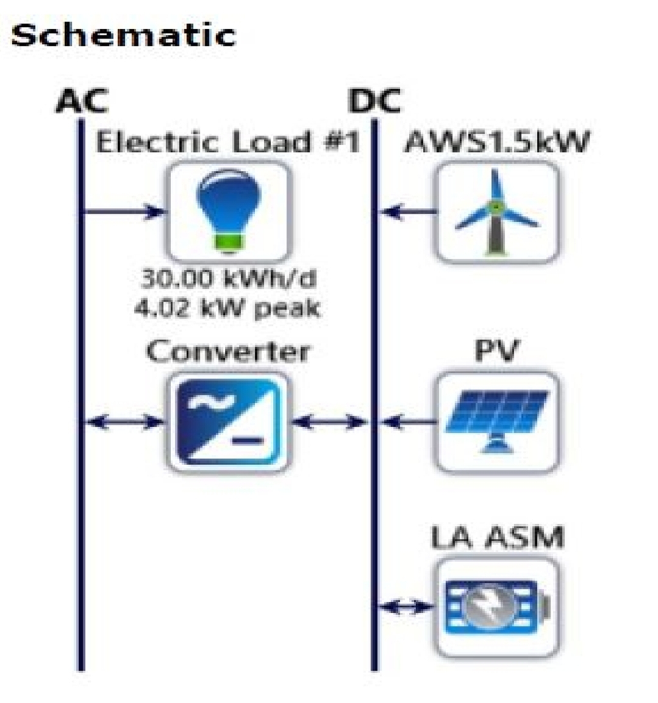

# 🌞🌬️ Hybrid Solar‑Wind Power Plant — Design, Simulation & Optimization

## 📖 Overview
This project presents the **design and optimization** of a **hybrid renewable energy system** integrating **solar photovoltaic (PV)** and **wind energy** sources.  
Using **HOMER software**, the system was modeled to achieve **optimal sizing, maximum energy yield, and cost efficiency** based on real‑world wind and solar atlas data.

Key features:
- **Hybrid generation**: Solar PV + wind turbines for continuous power supply
- **Data‑driven optimization** using HOMER
- **Cost analysis** for Levelized Cost of Energy (LCOE) and Net Present Cost (NPC)
- **Scalable design** for rural electrification or grid‑connected systems

---

## 🛠 Skills & Tools
- **Software:** HOMER, MS Excel, MATLAB (data analysis)
- **Renewable Energy:** Solar PV system design, wind turbine selection
- **Engineering:** Power plant sizing, load analysis, cost modeling
- **Project Management:** Research, documentation, presentation

---

## 📄 Documentation
- [System Design Report](docs/hybrid_pp.pdf)
- [Charts & Visuals](images/hybrid_power_plant_gallery/)

---

## 📸 Gallery
  
*Conceptual layout of the hybrid power plant.*

---

## 🔬 Design Highlights
1. **Resource Assessment** — Solar and wind atlas data used for accurate site modeling.
2. **System Sizing** — Optimized PV array and wind turbine capacity for target load.
3. **Economic Analysis** — LCOE and NPC calculated for multiple configurations.
4. **Reliability** — Designed for high availability with minimal storage requirements.

---

## 🚀 Potential Applications
- Rural electrification in off‑grid communities
- Supplementary renewable generation for industrial facilities
- Hybrid microgrids for islands and remote areas
- Grid‑tied renewable integration

---

